# AiQ - AiQuiz

<div align="center">

<!-- アプリケーションのメイン画像・ロゴスペース -->


**学習を革新する、AI搭載クイズプラットフォーム**

</div>

---

## アプリケーションURL

### 本番環境
- https://ai-q-frontend-git-dev-kaito0328s-projects.vercel.app/

無料のデプロイサービスを使用しており、起動に時間がかかるので、スクリーンショットで確認することを推奨します。


### 開発環境
- **Frontend**: http://localhost:3000
- **Backend API**: http://localhost:8080
- **Database**: PostgreSQL (localhost:5432)

---

## アプリケーション概要

**AiQ**は、Google Gemini AIを活用した次世代学習プラットフォームです。ユーザーが自分だけのクイズ問題集を作成・管理・学習し、AI機能で効率的な学習体験を提供します。

### 主要な特徴

**AI問題生成** - テキスト・PDF・CSVから自動で問題を生成  
**階層型管理** - コレクションセット→コレクション→問題の3層構造  
**カスタムクイズ** - 柔軟な条件設定とリアルタイム実行  
**ソーシャル機能** - フォロー・お気に入り・公開共有  
**モダンUI** - レスポンシブ・アニメーション対応

---

## スクリーンショット

<div align="center">

### メイン画面
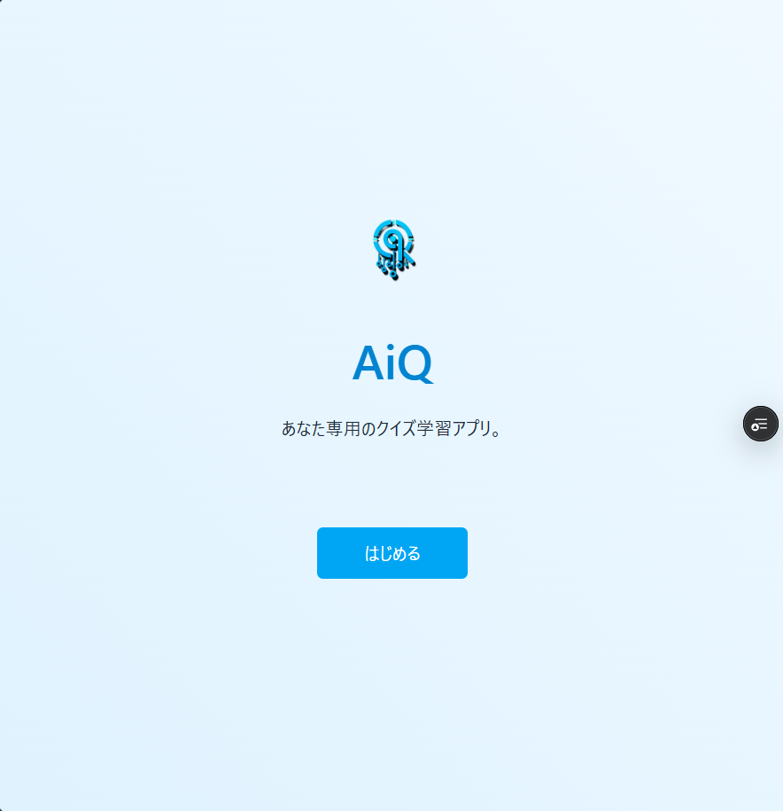
*アプリケーションのトップページ*


*ダッシュボード - ユーザーのメイン画面*

### AI問題生成機能
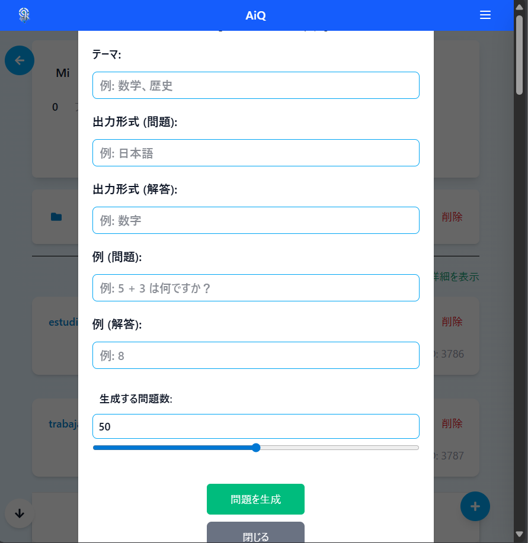
*テキストからのAI問題生成画面*

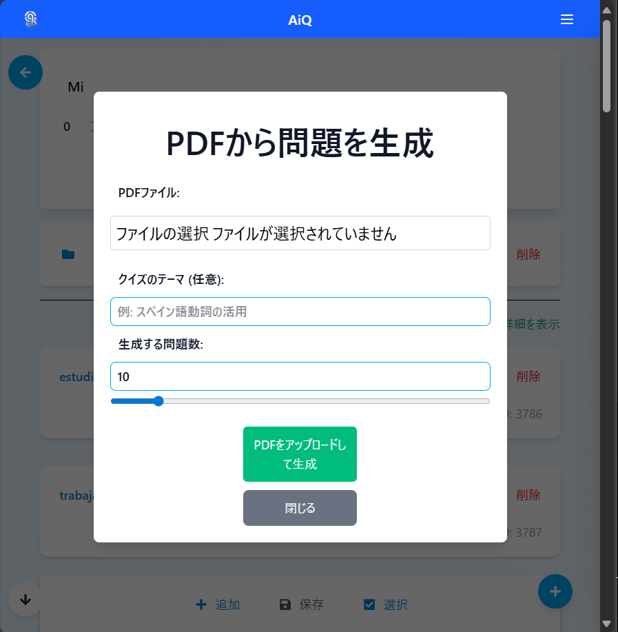
*PDFファイルからのAI問題生成画面*

### コンテンツ管理
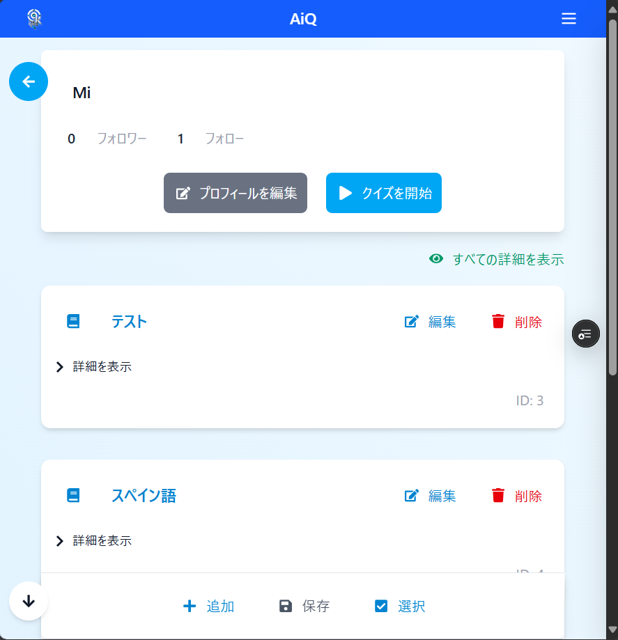
*階層型管理 - コレクションセット画面*

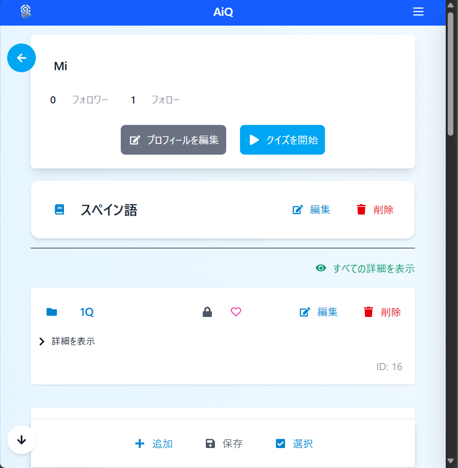
*コレクション管理画面*

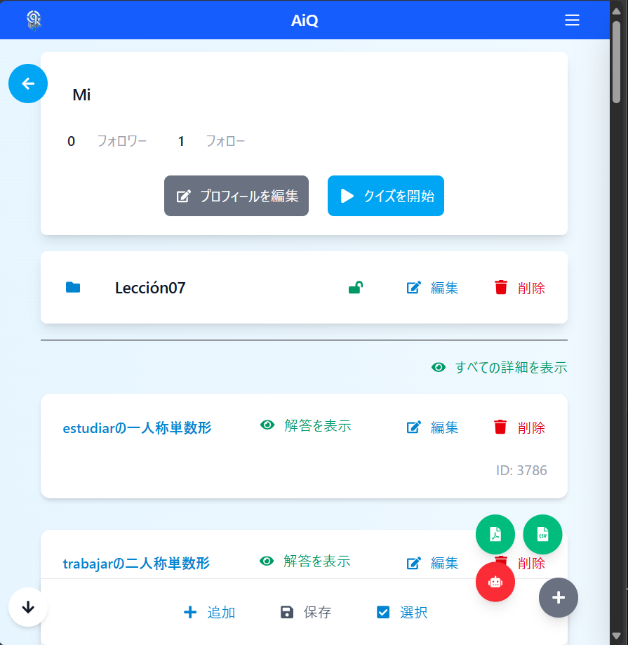
*問題管理画面*

### クイズ機能
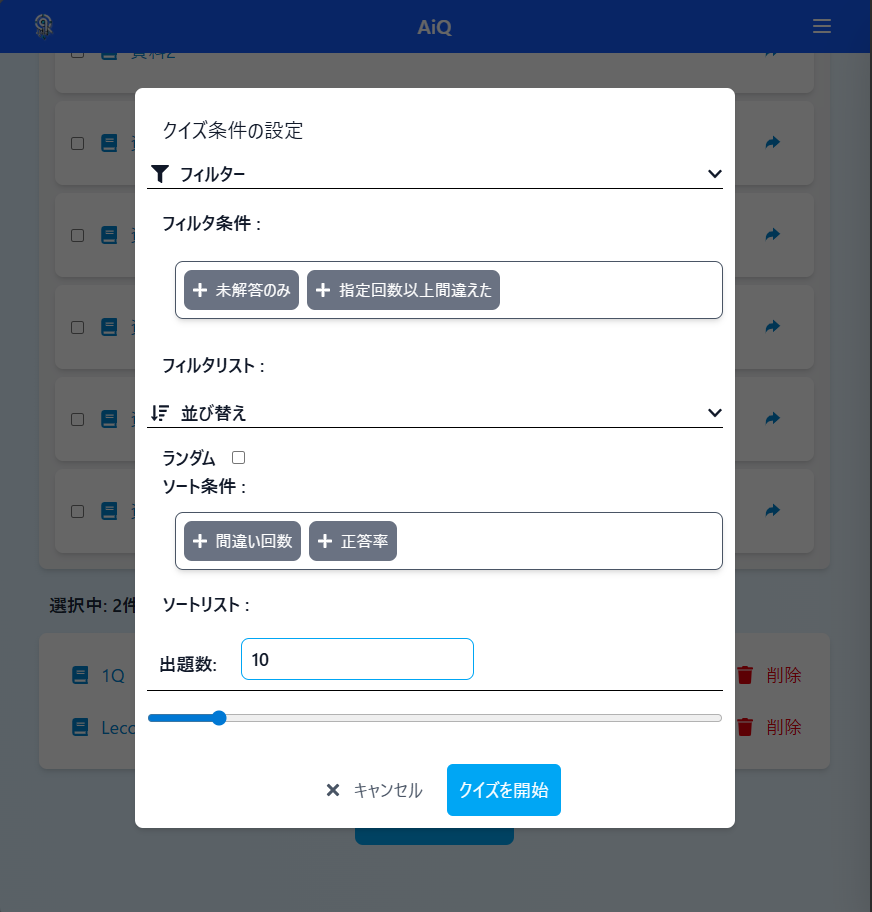
*フレキシブルなクイズ条件設定*

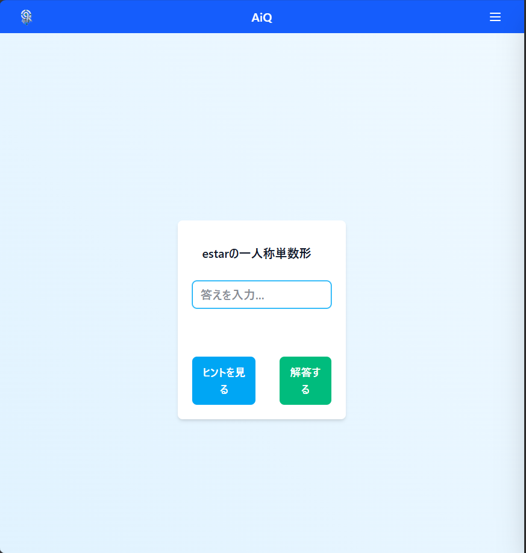
*クイズ画面*

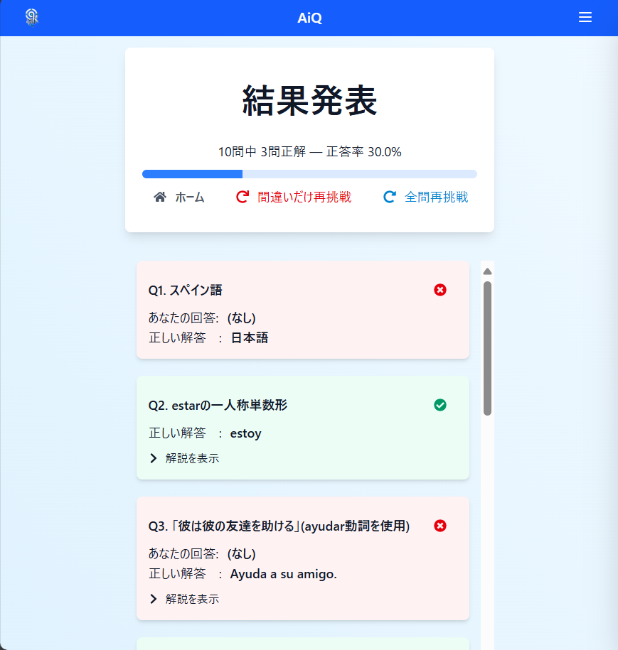
*結果表示*

### ソーシャル機能
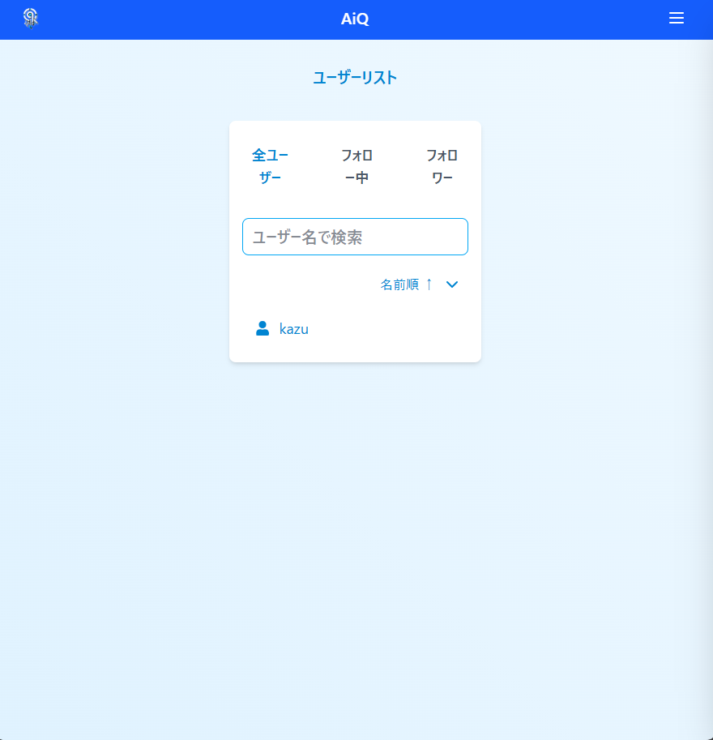
*ユーザー検索*

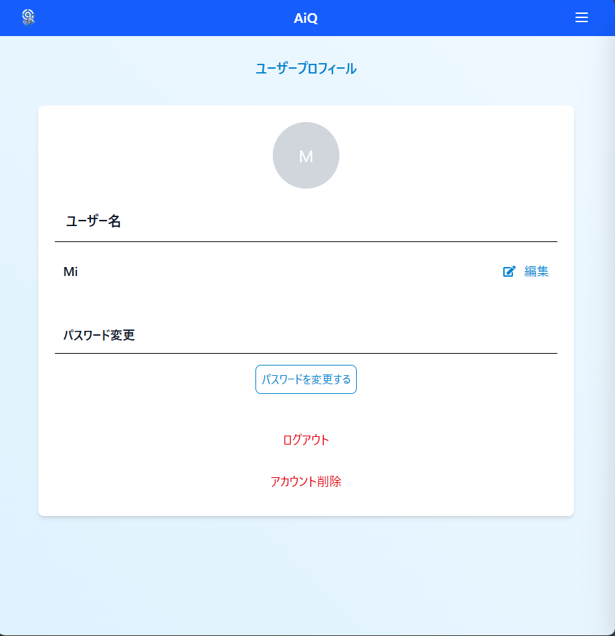
*ユーザープロフィール*

</div>

---

## システム構成

### アーキテクチャ図
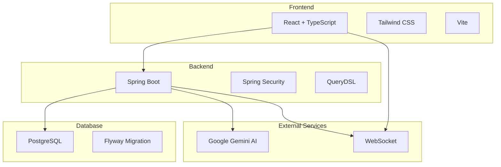

### 技術スタック

#### Frontend
- **React 19** + **TypeScript** - モダンなUI開発
- **Vite** - 高速ビルドツール
- **Tailwind CSS** - ユーティリティファーストCSS
- **Framer Motion** - 滑らかなアニメーション
- **React Router** - SPA ルーティング

#### Backend
- **Java 21** + **Spring Boot 3.2.2** - 堅牢なサーバーサイド
- **Spring Security** + **JWT** - セキュアな認証
- **Spring Data JPA** + **QueryDSL** - 型安全なデータアクセス
- **WebSocket** - リアルタイム通信

#### Database & Infrastructure
- **PostgreSQL** - リレーショナルデータベース
- **Docker** + **Docker Compose** - コンテナ化

#### AI & External Services
- **Google Gemini API** - AI問題生成
- **RESTful API** - フロントエンド・バックエンド通信

---

## クイックスタート

### 前提条件
- **Docker** & **Docker Compose**
- **Node.js** 18+ (ローカル開発時)
- **Java 21** (ローカル開発時)

### 1. リポジトリクローン
```bash
git clone https://github.com/Kaito0328/AiQ.git
cd AiQ
```

### 2. 環境変数設定
```bash
# バックエンド環境変数
# backend/.env ファイルを作成して以下を設定：
# GEMINI_API_KEY=your-gemini-api-key
# JWT_SECRET=your-jwt-secret

# フロントエンド環境変数
# frontend/.env ファイルを作成して以下を設定：
# VITE_API_BASE_URL=http://localhost:8080

# Docker Compose環境変数
# プロジェクトルートに .env ファイルを作成して以下を設定：
# POSTGRES_USER=aiq_user
# POSTGRES_PASSWORD=aiq_password
# POSTGRES_DB=aiq_db
```

### 3. Docker で起動
```bash
# 全サービス起動
docker-compose up -d

# 個別サービス起動
docker-compose up backend    # バックエンドのみ
docker-compose up frontend   # フロントエンドのみ
docker-compose up db        # データベースのみ
```

### 4. アクセス
- **Frontend**: http://localhost:3000
- **Backend API**: http://localhost:8080
- **Database**: localhost:5432

---

## 開発環境セットアップ

### ローカル開発 (ホットリロード有効)

#### バックエンド
```bash
cd backend
./gradlew bootRun
```

#### フロントエンド
```bash
cd frontend
npm install
npm run dev
```

#### データベース
```bash
docker-compose up db
```

### テスト実行
```bash
# バックエンドテスト
cd backend && ./gradlew test

# フロントエンド（テストファイルは現在未実装）
cd frontend && npm run lint

# Docker環境での統合テスト
docker-compose up -d && docker-compose logs
```

---

## 機能詳細

### AI問題生成機能
- **テキスト入力**: 自由記述から問題自動生成
- **PDFアップロード**: 教材PDFから問題抽出
- **CSV一括インポート**: 既存問題の効率的取り込み
- **リアルタイム進捗**: WebSocketによる生成状況通知

### 階層型コンテンツ管理
```
コレクションセット (例: 英語学習)
├── コレクション1 (例: TOEIC単語)
│   ├── 問題1: "Abandon"の意味は？
│   ├── 問題2: "Brief"の意味は？
│   └── ...
└── コレクション2 (例: 英文法)
    ├── 問題1: 時制について
    └── ...
```

### フレキシブルクイズシステム
- **カスタムフィルタ**: 難易度・カテゴリー別出題
- **ソート機能**: ランダム・作成日・正答率順
- **複数コレクション**: 横断的な学習セッション
- **中断・再開**: 学習の継続性サポート

### ソーシャル学習
- **フォロー機能**: 他ユーザーの学習を参考
- **公開コレクション**: 知識の共有とコミュニティ形成
- **お気に入り**: 優良コンテンツの保存
- **解答履歴**: 学習進捗の記録

---

## プロジェクト構造

```
AiQ/
├── backend/                 # Spring Boot バックエンド
│   ├── src/main/java/      # Javaソースコード
│   ├── src/main/resources/ # 設定ファイル・マイグレーション
│   ├── src/test/           # テストコード
│   ├── build.gradle        # ビルド設定
│   └── Dockerfile          # バックエンドコンテナ設定
├── frontend/               # React フロントエンド
│   ├── src/                # TypeScriptソースコード
│   ├── public/             # 静的ファイル
│   ├── package.json        # NPM設定
│   └── Dockerfile          # フロントエンドコンテナ設定
├── docker-compose.yml      # Docker構成
└── README.md              # このファイル
```

---

## Documentation

### 開発ガイド
- [Backend Development](./backend/README.md) - バックエンド開発ガイド
- [Frontend Development](./frontend/README.md) - フロントエンド開発ガイド

### プロジェクト情報
- [Docker Compose設定](./docker-compose.yml) - 環境構築設定

---

## テスト

### 現在のテスト状況
- **バックエンド**: JUnit 5 + MockMvc によるテストを実装済み
- **フロントエンド**: テストファイルは今後実装予定
- **統合テスト**: Docker環境での動作確認

### テスト実行方法
```bash
# バックエンドテスト実行
cd backend
./gradlew test

# テストレポート確認
./gradlew test --info

# フロントエンドのコード品質チェック
cd frontend
npm run lint
```
